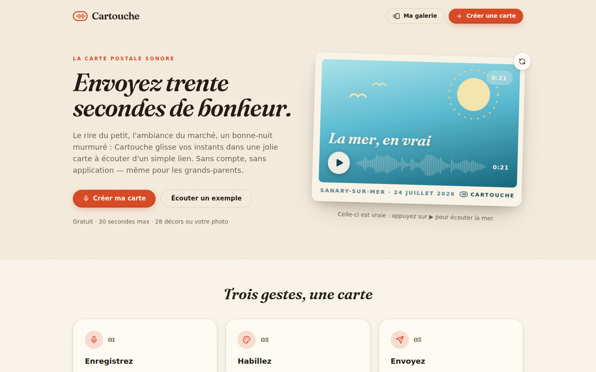
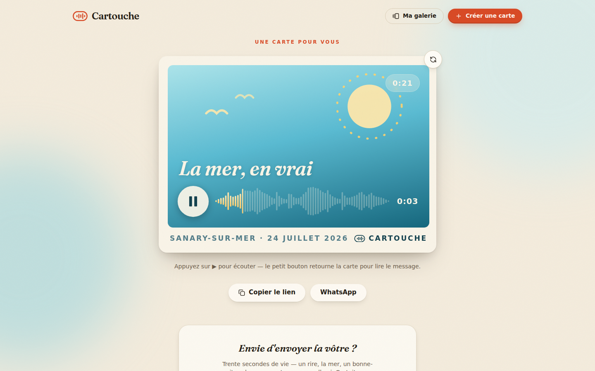
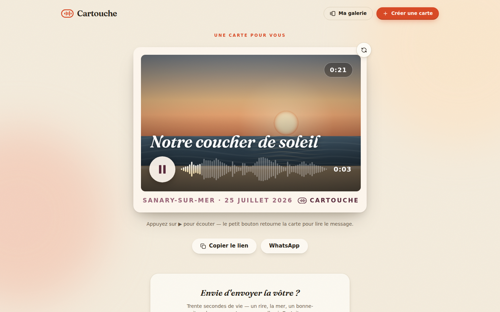
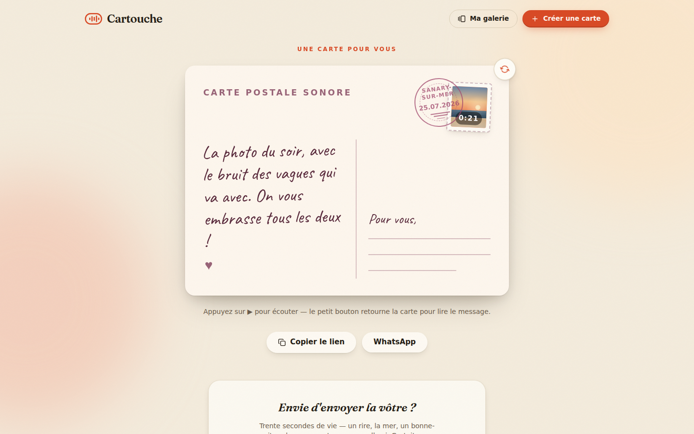
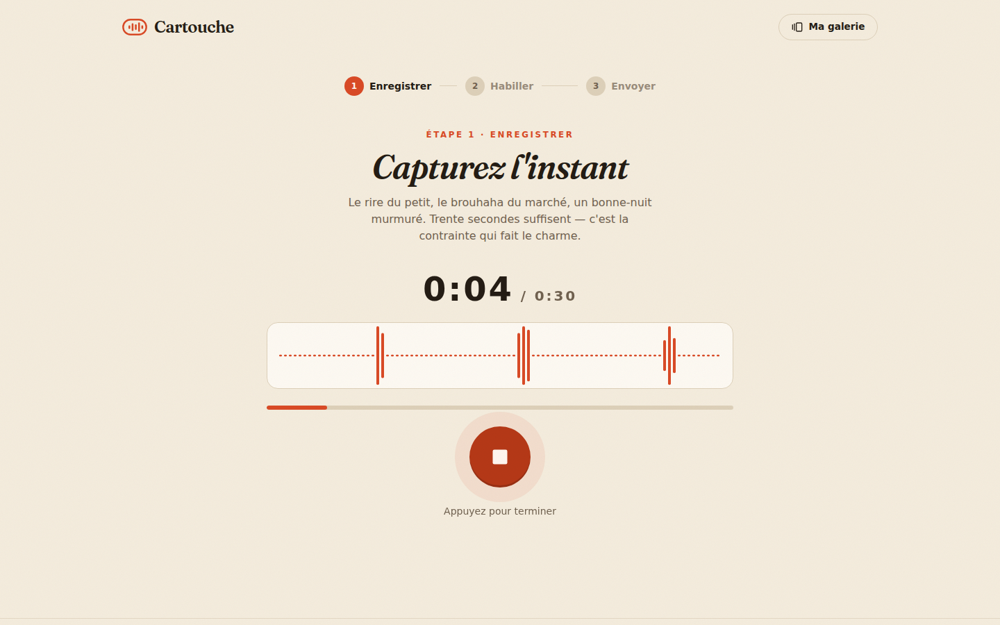
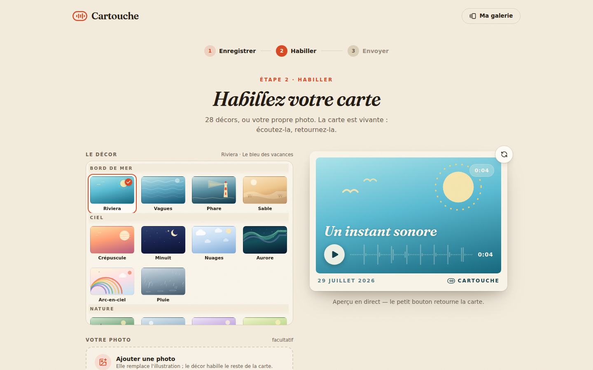
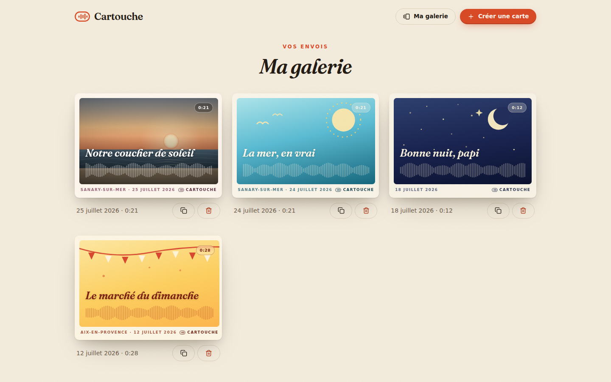
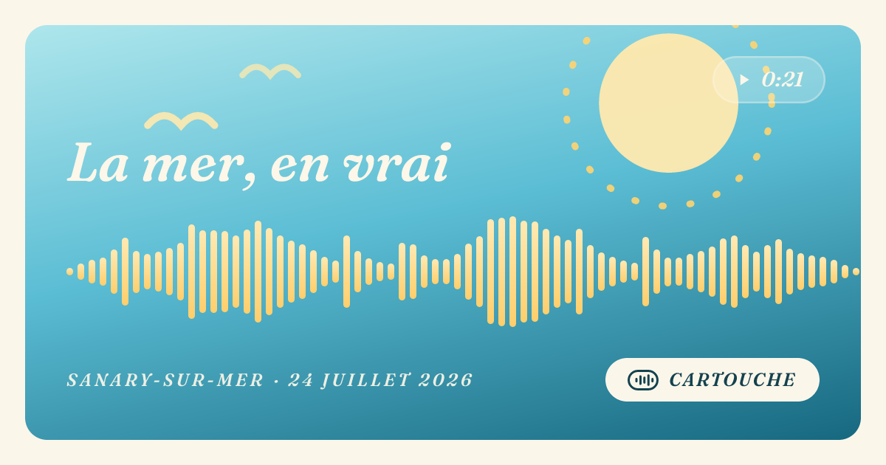
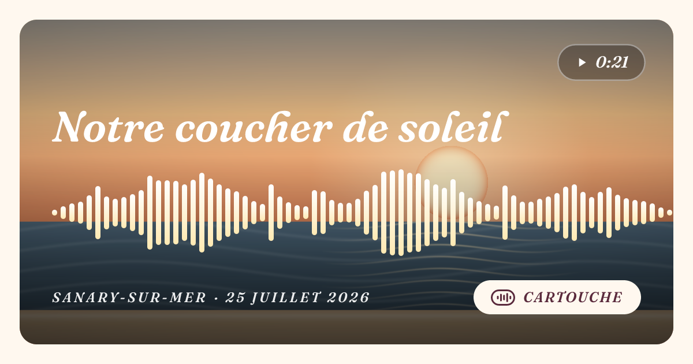

# Cartouche — la carte postale sonore

[](https://github.com/andyrandriamiarisoa-web/cartouche/actions/workflows/ci.yml)

**Enregistrez 30 secondes de vie — le rire du bébé, l'ambiance du marché, un
« bonne nuit » — et envoyez-les dans une jolie carte postale sonore.** Un lien
à partager avec les grands-parents, sans compte ni application à installer.
Tiramisa garde, Cartouche envoie.

| L'accueil | Une carte reçue |
| --- | --- |
|  |  |

| Avec votre photo | Le verso manuscrit |
| --- | --- |
|  |  |

| Enregistrement | Habillage · 28 décors | La galerie |
| --- | --- | --- |
|  |  |  |

Les aperçus générés pour WhatsApp / iMessage — illustration ou photo :

| | |
| --- | --- |
|  |  |

## Ce que fait l'application

- **Enregistrement dans le navigateur** (30 s max) : visualisation temps réel
  façon mémo vocal, minuteur, arrêt automatique. Réduction de bruit désactivée
  pour garder le vrai grain d'un marché ou de la mer.
- **Audio universel** : l'enregistrement (WebM/Opus sur Chrome, MP4/AAC sur
  Safari) est décodé puis **ré-encodé en WAV PCM côté client** — la carte
  s'écoute partout, y compris sur de vieux appareils. La forme d'onde
  (72 barres) est calculée au même moment.
- **28 décors soignés**, groupés en six familles (Bord de mer, Ciel, Nature,
  Fêtes, Douceurs, Ailleurs) : chacun a son illustration SVG dessinée à la
  main, son papier, son timbre, son cachet de la poste et sa forme d'onde
  assortie. Aperçu vivant pendant l'habillage (titre, lieu, mots au verso).
- **Ou votre propre photo** : elle remplace l'illustration au recto et se
  glisse dans le timbre au verso, pendant que le décor choisi continue
  d'habiller le papier. La photo est recadrée en 4:3 et ré-encodée en JPEG
  **dans le navigateur** — ce qui allège l'envoi et retire au passage les
  métadonnées EXIF, position GPS comprise.
- **Carte recto/verso** : flip 3D, message manuscrit, timbre dont la valeur est
  la durée de l'enregistrement, cachet au lieu et à la date d'envoi. Le même
  composant fluide (container queries) sert partout : hero, studio, galerie,
  page publique.
- **Page publique par lien** (`/c/{id}`) : lecture avec progression sur l'onde,
  seek au doigt ou au clavier, ambiance colorée assortie au thème. Aucun compte
  requis pour écouter.
- **Aperçu riche dans les messageries** : image OpenGraph générée par carte
  (thème, titre, forme d'onde, durée) + `og:audio`.
- **Galerie personnelle** (`/galerie`) : les cartes envoyées depuis l'appareil,
  stockées en localStorage. Copie de lien, suppression en deux temps.
- **Suppression sécurisée** : un jeton de propriété est remis à l'envoi ; seule
  son empreinte SHA-256 est stockée. `DELETE /api/cards/{id}` efface l'audio et
  les métadonnées.
- **Cartes de démonstration embarquées** (`/c/demo` et `/c/demo-photo`) : audio
  et photo synthétisés par script, commités dans le repo — elles fonctionnent
  même sans stockage configuré.

## Architecture

**Zéro base de données.** Chaque carte vit dans Vercel Blob :

```
cards/{id}/audio.wav    ← WAV PCM mono, immuable, cache 1 an
cards/{id}/photo.jpg    ← photo facultative, recadrée en 4:3 côté client
cards/{id}/card.json    ← métadonnées + empreinte du jeton de propriété
```

- `POST /api/cards` — multipart (WAV ≤ 8 Mo, photo JPEG ≤ 4 Mo facultative,
  métadonnées JSON validées : longueurs, thème, durée, forme d'onde, signatures
  RIFF/WAVE et JPEG, garde d'origine). Répond
  `{ id, path, createdAt, ownerToken, photoUrl }`.
- `GET /c/{id}` — rendu serveur : `list()` sur le préfixe, lecture du JSON,
  `notFound()` sinon. Métadonnées OG + image générée (`opengraph-image.tsx`,
  fonte Fraunces embarquée, cache CDN 24 h). Les décors sont partagés entre la
  carte, le sélecteur et l'image OG : une seule source de vérité
  (`components/postcard/decors.tsx`).
- `DELETE /api/cards/{id}` — `Authorization: Bearer {ownerToken}`, comparaison
  d'empreintes à temps constant, suppression du préfixe complet.

Identifiants : 12 caractères base58 (≈ 10²¹ possibilités) — les liens ne se
devinent pas. La galerie est locale à l'appareil (pas de tracking, pas de
compte).

Deux contraintes de `next/og` (satori) ont façonné le rendu de l'image de
partage, et sont documentées dans le code : satori n'exécute pas les composants
React imbriqués dans un `<svg>` (les décors sont donc de simples fonctions
appelées directement), et il écarte un `<svg>` plus grand que la boîte de
contenu de son parent (la zone illustrée n'a donc aucun padding, et le décor
est recadré via son `viewBox`).

**Stack** : Next.js 15 (App Router) · TypeScript strict · Tailwind CSS 4 ·
Vercel Blob · lucide-react · Vitest. Fontes : Fraunces (titres), Caveat
(manuscrit) — licence OFL, TTF embarquée pour l'image OG.

## Démarrer en local

```bash
npm install
npm run dev
```

Sans configuration, tout est visible (accueil, studio jusqu'à l'envoi, carte
`/c/demo`, galerie). Pour activer l'envoi, renseignez `BLOB_READ_WRITE_TOKEN`
(voir `.env.example`) :

```bash
cp .env.example .env.development.local
# puis collez le jeton du Blob store, ou : vercel env pull .env.development.local
```

Scripts utiles :

```bash
npm test              # tests unitaires (WAV, onde, validation, ids, décors, photo)
npm run lint          # ESLint
npm run typecheck     # tsc --noEmit
npm run build         # build de production
npm run demo:audio    # régénère l'audio de démo (déterministe)
npm run demo:photo    # régénère la photo de démo (déterministe)
npm run screenshots   # captures docs/ (serveur de prod sur :4310 requis)
```

## Déployer sur Vercel

1. **Importer le repo** dans Vercel (framework détecté : Next.js, rien à
   configurer).
2. **Créer le Blob store** : onglet **Storage** du projet → **Create Database**
   → **Blob** → le connecter au projet. La variable `BLOB_READ_WRITE_TOKEN`
   est injectée automatiquement. _C'est la seule étape manuelle._
3. Redéployer si le store a été créé après le premier déploiement.

Les URL publiques (OG, sitemap) se déduisent automatiquement de
`VERCEL_PROJECT_PRODUCTION_URL` ; `NEXT_PUBLIC_SITE_URL` permet de forcer un
domaine personnalisé.

## Limites connues (v1)

- Pas de rate-limiting sur l'API d'envoi (à ajouter — Upstash ou Vercel WAF —
  si l'usage dépasse le cercle familial).
- La galerie est liée au navigateur : vider ses données efface la liste
  (pas les cartes elles-mêmes — les liens restent valides).
- Cartes publiques pour qui possède le lien, non listées, non indexées
  au-delà de la démo.

## La semaine idéale (plan d'origine)

Lundi capture audio + onde SVG · mardi générateur de cartes + image OG ·
mercredi page publique par lien · jeudi galerie personnelle · vendredi
finitions et déploiement — livrés d'un seul tenant, avec CI, tests et captures
en prime. En rab : 28 décors et la photo personnelle.
